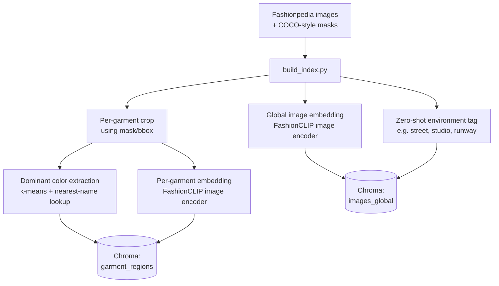
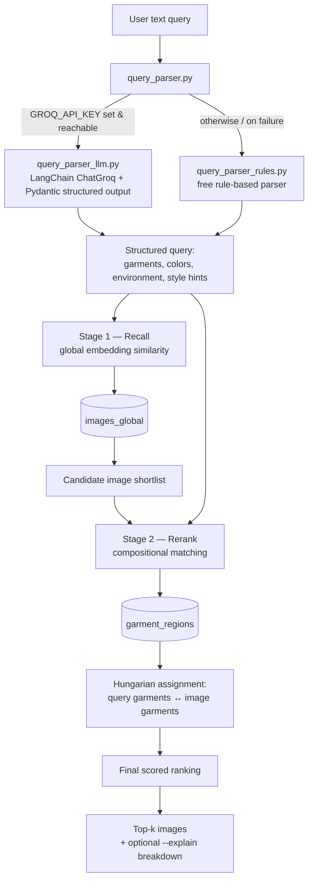

# 👗 Fashion Search Engine

**Natural-language image retrieval over the Fashionpedia dataset.**

Search a fashion photo collection the way you'd describe it to a person —
*"a person in a bright yellow raincoat standing on a rainy street"* — and get
back the right images. Unlike vanilla CLIP, this system understands **which
color belongs to which garment**, so *"a red tie and a white shirt"* is not
treated the same as *"a white tie and a red shirt."*

---

## Table of Contents

- [Overview](#overview)
- [Why Not Just Vanilla CLIP?](#why-not-just-vanilla-clip)
- [Architecture](#architecture)
- [End-to-End Flow](#end-to-end-flow)
- [Repo Layout](#repo-layout)
- [Setup](#setup)
- [Run](#run)
- [Design Decisions](#design-decisions-worth-knowing-about)
- [Configuration](#configuration)

---

## Overview

| | |
|---|---|
| **Dataset** | [Fashionpedia](https://fashionpedia.github.io/home/) (val split, 500–1,000 images) |
| **Embedding model** | FashionCLIP (image + text encoders) |
| **Vector store** | Chroma (swappable for Qdrant/Milvus) |
| **Query parsing** | LLM-first (LangChain `ChatGroq` + Pydantic), free rule-based fallback |
| **Matching** | Two-stage: dense recall → compositional rerank (Hungarian assignment) |
| **Output** | Ranked top-*k* images, optional visual contact sheets |

The system is split into two independent halves that meet at the vector
store:

1. **Indexer (Part A)** — turns raw Fashionpedia images into a searchable,
   attribute-aware vector index.
2. **Retriever (Part B)** — turns a free-text query into a structured
   representation and searches that index.

---

## Why Not Just Vanilla CLIP?

A single CLIP embedding compresses an entire image (or an entire query) into
**one vector**. Garments and colors get blended into a "bag of attributes"
with no record of which color belongs to which item — a well-documented
*compositionality gap* in CLIP-family models.

This project closes that gap by embedding **each garment separately**, tagging
it with a deterministically-extracted color, and matching **garment-to-garment**
at query time instead of comparing one blended vector to another.

See `docs/writeup.pdf` for the full comparison of approaches and why this one
was chosen over the alternatives.

---

## Architecture

```
                    ┌─────────────────────────┐
   Fashionpedia  →  │        INDEXER          │
   (images +        │  1. global image embed  │──► images_global   (Chroma)
   COCO masks)      │  2. per-garment crop +  │
                    │     dominant color      │
                    │  3. per-garment embed   │──► garment_regions (Chroma)
                    │  4. zero-shot env tag   │
                    └─────────────────────────┘

   query text    →   ┌─────────────────────────┐
                     │       RETRIEVER         │
                     │  Stage 1: recall via    │
                     │  global embedding sim   │
                     │  Stage 2: rerank via    │
                     │  structured query parse │
                     │  + Hungarian-assignment │
                     │  compositional matching │
                     └─────────────────────────┘  → top-k images
```

- **`indexer/`** — Part A. Turns raw images into a searchable vector store.
- **`retriever/`** — Part B. Turns a text query into structured + dense search.
- **`eval/`** — runs the 5 required benchmark queries and (optionally) saves
  visual contact sheets of the results.
- **`config.py`** — every path, model name, and scoring weight lives here —
  the ML logic in `indexer/` and `retriever/` never hardcodes any of it.

---

## End-to-End Flow

### 1. Indexing pipeline (offline, runs once)



### 2. Query / retrieval pipeline (online, per search)



**In words:**
1. A query like *"a red tie and a white shirt"* is parsed into a structured
   form: `{garments: [tie(red), shirt(white)], environment: null, style_hints: []}`.
2. **Stage 1 (recall)** uses the global image embeddings to quickly narrow
   the full index down to a candidate shortlist.
3. **Stage 2 (rerank)** compares the query's garments against each
   candidate's *individual* garment embeddings + colors, using a Hungarian
   (optimal bipartite) assignment so each query garment is matched to its
   best corresponding garment in the image — this is what prevents
   color/garment attributes from being mixed up.
4. Candidates are re-scored on this compositional match and returned as the
   final top-*k* ranking.

---

## Repo Layout

```
config.py                    shared paths, model names, scoring weights
indexer/
  attribute_taxonomy.py      controlled vocab: garments, colors, environments
  color_extraction.py        k-means dominant color + nearest-name mapping
  embed_model.py              FashionCLIP wrapper (image + text encoders)
  environment_classifier.py  zero-shot scene classification
  build_index.py             Part A entry point
retriever/
  query_parser.py            dispatcher: LLM-first, rule-based fallback
  query_parser_llm.py        Groq + Pydantic structured-output parser
  query_parser_rules.py      free text -> {garments, environment, style_hints}
  search.py                  two-stage recall + compositional rerank
  cli.py                     Part B entry point
eval/
  eval_queries.py            runs the 5 required benchmark queries
data/
  download_fashionpedia.py   dataset setup instructions
```

---

## Setup

```bash
pip install -r requirements.txt

# Downloads Fashionpedia's val split (1,158 images -- fits the 500-1,000
# requirement out of the box) via Hugging Face `datasets`, no manual
# click-through, and converts it to the COCO format build_index.py expects.
python data/download_fashionpedia.py --split val --limit 1000
```

This mirror provides bounding boxes rather than the original release's exact
pixel masks (each box is written as a rectangle "mask" so the rest of the
pipeline is unaffected) — see `data/download_fashionpedia.py`'s docstring if
you'd rather use the original pixel-exact-mask release instead.

### Optional — LLM-based query parsing

By default, queries are parsed with a free, offline rule-based parser. For
better handling of natural phrasing (negation, implied attributes), the
system uses **LangChain's `ChatGroq`** (from `langchain-groq`) and will pick
it up automatically, falling back to the rule-based parser if it's ever
unavailable.

Create a `.env` file in the project root with your key:

```
GROQ_API_KEY=your_key_here   # https://console.groq.com/keys
```

`ChatGroq` picks this up automatically (via `python-dotenv` / LangChain's
built-in env loading) — no manual `export` needed.

---

## Run

```bash
# 1. build the index (needs internet access to pull the FashionCLIP checkpoint
#    from Hugging Face the first time; cached locally after that)
python -m indexer.build_index --limit 800

# 2. query it
python -m retriever.cli "A person in a bright yellow raincoat." --top_k 5 --explain

# 3. run the 5 required evaluation queries + save contact sheets
python -m eval.eval_queries --top_k 5 --save_sheets
```

---

## Design Decisions Worth Knowing About

**Ground-truth segmentation instead of a live detector.**
Fashionpedia ships garment-level annotations (the HF mirror used by the
auto-download script gives bounding boxes; the original release gives
pixel-exact polygon masks). Rather than spend CPU budget running a live
object detector (Mask R-CNN / GroundingDINO) at index time, the provided
annotations are used directly to crop garments and extract color. For images
*without* annotations (e.g. extending this to a new unlabeled dataset), see
"Future Work" in the write-up for the lightweight-detector fallback.

**Deterministic color extraction, not zero-shot CLIP color classification.**
K-means on the masked garment pixels + nearest-name lookup is both cheaper
and more accurate than asking CLIP "what color is this" — see
`indexer/color_extraction.py`'s docstring for why.

**Query parsing: LLM-first with a free rule-based fallback, not one or the
other.** `retriever/query_parser.py` tries a structured parser built on
**LangChain's `ChatGroq`** (`query_parser_llm.py`, Pydantic schema via
LangChain's structured-output support) first, since it handles phrasing the
rule-based parser can't — negation, implied attributes, unusual clause
order. If `GROQ_API_KEY` isn't set, or the call fails for any reason, it
degrades automatically to the zero-latency rule-based parser
(`query_parser_rules.py`) rather than failing the query. Both return the
identical structured dict shape, so `search.py` never knows or cares which
one ran.

**Everything is config-driven and path-agnostic** (`config.py`), and the ML
logic (`indexer/`, `retriever/`) has zero knowledge of *how* vectors are
stored — swapping Chroma for Qdrant/Milvus at 1M-image scale only touches the
`chromadb.PersistentClient(...)` lines.

---

## Configuration

All tunable values live in `config.py`, including:

- Dataset paths and index limits
- FashionCLIP checkpoint name / cache location
- Chroma collection names (`images_global`, `garment_regions`)
- Stage-1 recall size and Stage-2 rerank weights
- Attribute taxonomy source (garments, colors, environments)

Nothing in `indexer/` or `retriever/` hardcodes a path, model name, or
scoring weight — change behavior by editing `config.py`, not the pipeline
code.
